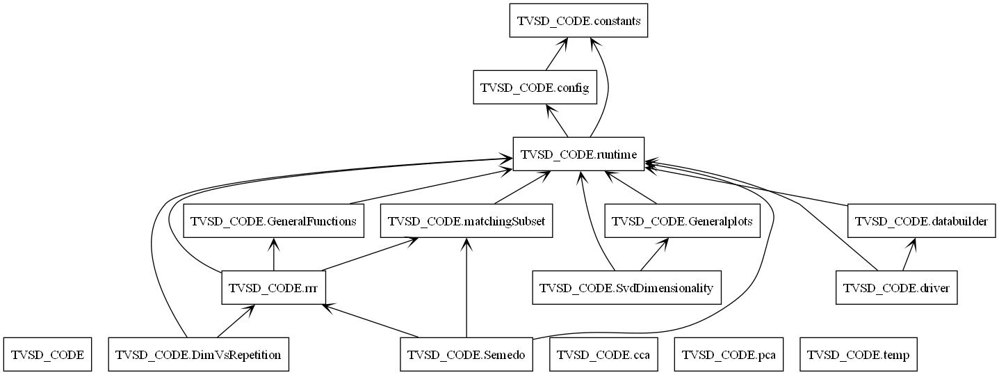
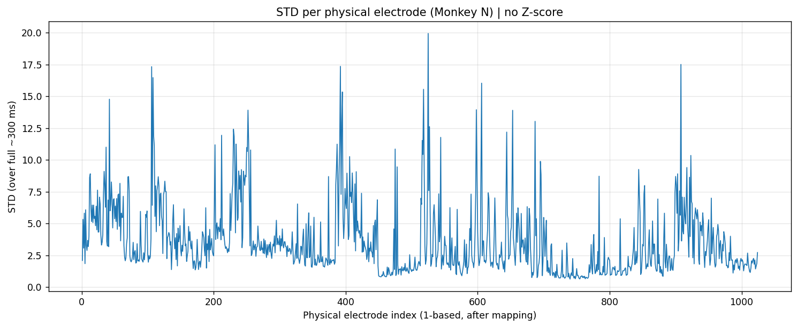

# TVSD_CODE — THINGS Ventral Stream Spiking Dataset (TVSD) – Analysis Toolkit

> Large-scale electrophysiological analyses for macaque **V1, V4, IT** (TVSD), including full preprocessing, Z-score variants, residuals, dimensionality, and cross-area prediction via **Reduced-Rank Regression (RRR)**.

**Author:** Idan Suliman  
**Thesis:** M.Sc., Bar-Ilan University — Gonda Multidisciplinary Brain Research Center  
**Advisor:** Dr. Zvi Roth  
**Contact:** Idansu123456@gmail.com


---

## Overview

This project analyzes large-scale macaque MUA recordings (TVSD) across **V1, V4, and IT** using a full processing pipeline — **Z-score variants**, **residuals**, and **cross-area prediction via RRR**.  
The goal is to quantify **representational dimensionality** and **inter-areal communication subspaces across days**, with reproducible runs, clear folder structure, and curated outputs (**figures, metrics, logs**).


---

## About TVSD (upstream dataset)

**TVSD**: *THINGS Ventral Stream Spiking Dataset* — large-scale recordings from **V1, V4, IT** in two macaques responding to ~22k images from the **THINGS** database.  
**Credits:** Paolo Papale, Feng Wang, Matthew W. Self, Pieter R. Roelfsema; Netherlands Institute for Neuroscience (KNAW), Amsterdam.

**Notes**
- THINGS images are **not** included; download them from **things-initiative.org**.
- For common issues, see the TVSD repo issues (open & closed).

---

## Repository layout (high-level)

```
TVSD_CODE/
├─ core/                        # Infrastructure
│  ├─ config.py                 # Paths & Monkey configurations
│  ├─ constants.py              # Global analysis parameters
│  └─ runtime.py                # Global state manager
│
├─ data/                        # Data Management
│  ├─ data_manager/             # Central data loader package
│  └─ databuilder.py            # Preprocessing & Normalization
│
├─ methods/                     # Scientific Methods
│  ├─ dimensionality_correlation/ # Stability vs Dimensionality
│  ├─ repetition_stability/     # Subspace stability analysis
│  ├─ rrr/                      # Reduced Rank Regression logic
│  ├─ Semedo/                   # Semedo 2019 replication logic
│  ├─ visualization/            # Plotting & Figures
│  ├─ matchingSubset.py         # V1-MATCH subset selection
│  └─ pca.py                    # PCA utilities
│
└─ drivers/                     # Execution Drivers
   └─ driver.py                 # Main Repetition Stability Analysis
```



---

## Setup

Create a clean Python environment and install dependencies:

```bash
python -m venv .venv

# Activate:
#   Windows (PowerShell): .\.venv\Scripts\Activate.ps1
#   Windows (cmd):        .\.venv\Scripts\activate.bat
#   macOS/Linux:          source .venv/bin/activate

pip install -r requirements.txt
```

---

## How to Run

Run the analysis drivers from the root directory:

```powershell
python drivers/driver.py
```

---

## Processing pipeline (A → D)

1) **Step A — Split by day & region**  
   Extract `(time=300, trials, electrodes)` per **Day × Region** → `Processed_by_day/Day_XX/<Region>.npz`.

2) **Step B — Split by test stimuli**  
   Keep **test set only** (100 images × 30 reps), group by `stimulus_id` →  
   `Processed_by_trial/Day_XX/<Region>/stimulus_YYY.npz` with arrays `(300, num_trials, num_neurons)`.

3) **Step C — Response Extraction & Normalization**  
   Trials consist of 300 ms recordings (100 ms pre-stimulus + 200 ms evoked). We reduce the time-series to a single scalar per trial using three methods:
   - **Evoked Window**: Mean activity within latency windows (**V1**: 126-225 ms; **V4**: 151–250 ms; **IT**: 176-275 ms).
   - **Baseline**: Mean activity during the 1-100 ms pre-stimulus period.
   - **Residual**: The Evoked Window value minus the image-specific mean response, isolating trial-by-trial fluctuations.

   **Normalization**: Neural responses are standardized ($Z_{ij} = (X_{ij} - \mu) / \sigma$) using four schemes:
   - **Per-day**: Computed independently within each recording day (robust to day-to-day offsets).
   - **Global**: Computed over the full dataset (robust to overall gain differences).
   - **Repetition-wise**: Computed locally within each repetition (robust to slow trends).
   - **Raw**: Retained as an unnormalized control.

4) **Step D — Matrix Formation**  
   After each preprocessing variant, electrodes from the same region are stacked into a **trial × electrode matrix X** (rows = trials, columns = electrodes), which is used throughout downstream analyses (Dimensionality, RRR).

These outputs feed **dimensionality (PCA/SVD)** and **RRR** (e.g., **V1→V4**, **V1→IT**) including **V1-MATCH** variants.

---

## Mapping file (ROI / Electrode mapping)

Each monkey’s mapping defines a **bijective** correspondence between **logical** and **physical** electrode indices (1–1024).  
This is the **authoritative** lookup through all stages for:
- aligning activity matrices across preprocessing,
- assigning electrodes to **V1 / V4 / IT**,
- maintaining **stable channel identities across days**.

In code: load via `config.py` → access with `runtime.get_cfg().get_mapping()`; ROI vector via  
`runtime.get_consts().ROIS_PHYSICAL_BY_MONKEY[...]`.  
To convert: `logical_rois = physical_rois[mapping]`.

---

## Electrode quality & removal (Monkey N — V1)

QC revealed a **continuous block of 64 non-functional electrodes** at **logical indices 256–319 (inclusive)** — i.e., **after applying the physical→logical mapping**.  
Per-electrode statistics showed **near-zero STD across trials**, indicating no meaningful neural signal.




**Action taken**
- Excluded these electrodes from analysis.  
- Updated both **mapping logic** and **raw/processed arrays** to preserve **1:1 logical–physical structure** after removal.  
- All downstream steps (A–D, dim/RRR) use the **filtered** set with consistent indexing.