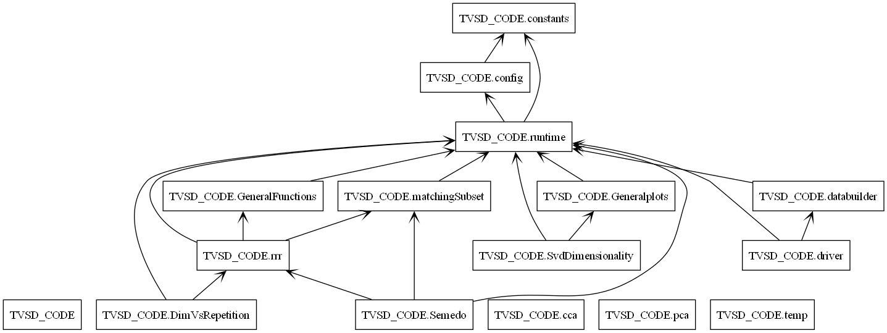
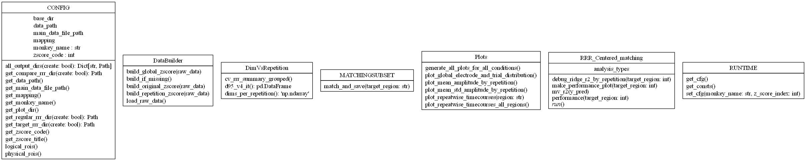
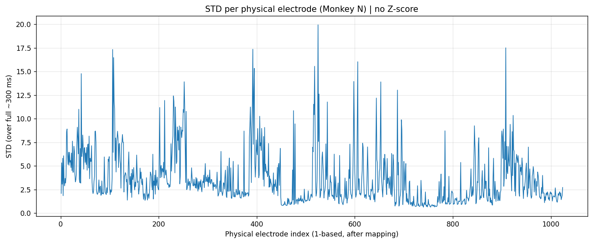

# TVSD_CODE — THINGS Ventral Stream Spiking Dataset (TVSD) – Analysis Toolkit

> Large-scale electrophysiological analyses for macaque **V1, V4, IT** (TVSD), including full preprocessing, Z-score variants, residuals, dimensionality, and cross-area prediction via **Reduced-Rank Regression (RRR)**.

**Author:** Idan Suliman  
**Thesis:** M.Sc., Bar-Ilan University — Gonda Multidisciplinary Brain Research Center  
**Advisor:** Dr. Zvi Roth  
**Contact:** Idansu123456@gmail.com


---

## Overview

This project analyzes large-scale macaque MUA recordings (TVSD) across **V1, V4, and IT** using a full processing pipeline — **Z-score variants**, **residuals**, and **cross-area prediction via RRR**.  
The goal is to quantify **representational dimensionality** and **inter-areal communication subspaces across days**, with reproducible runs, clear folder structure, and curated outputs (**figures, metrics, logs**).


---

## About TVSD (upstream dataset)

**TVSD**: *THINGS Ventral Stream Spiking Dataset* — large-scale recordings from **V1, V4, IT** in two macaques responding to ~22k images from the **THINGS** database.  
**Credits:** Paolo Papale, Feng Wang, Matthew W. Self, Pieter R. Roelfsema; Netherlands Institute for Neuroscience (KNAW), Amsterdam.

**Notes**
- THINGS images are **not** included; download them from **things-initiative.org**.
- For common issues, see the TVSD repo issues (open & closed).

---

## Repository layout (high-level)

```text
TVSD_CODE/
├─ TVSD_CODE/
│  ├─ config.py             # Paths, monkey/Z-score settings, mapping loader, runtime helpers
│  ├─ constants.py          # ROI IDs, region windows, colors, default CV/RRR params, dirs
│  ├─ runtime.py            # Hub exposing config + constants, safe loaders
│  ├─ databuilder.py        # Step A–D builders (by-day, by-trial, normalization, residuals)
│  ├─ GeneralFunctions.py   # Utilities
│  ├─ Generalplots.py       # Plot helpers & exporters
│  ├─ DimVsRepetition.py    # Dimensionality vs repetition
│  ├─ StdDimensionality.py  # STD diagnostics & dimensionality checks
│  ├─ Semedo.py             # RRR / communication-subspace analyses
│  ├─ matchingSubset.py     # V1-MATCH subset selection
│  ├─ pca.py                # Algorithms (if split)
│  ├─ cca.py
│  ├─ rrr.py
│  └─ driver.py             # Ad-hoc runners (optional)
├─ data/                    # Raw & processed (git-ignored)
├─ outputs/                 # Figures, tables, logs
└─ docs/
   └─ figures/              # README/slide assets (logo, connectivity, etc.)
```






---

## Processing pipeline (A → D)

1) **Step A — Split by day & region**  
   Extract `(time=300, trials, electrodes)` per **Day × Region** → `Processed_by_day/Day_XX/<Region>.npz`.

2) **Step B — Split by test stimuli**  
   Keep **test set only** (100 images × 30 reps), group by `stimulus_id` →  
   `Processed_by_trial/Day_XX/<Region>/stimulus_YYY.npz` with arrays `(300, num_trials, num_neurons)`.

3) **Step C — Time-window average & Z-score**  
   Region windows: **V1: 25–125 ms, V4: 50–150 ms, IT: 75–175 ms**.  
   Average over time ⇒ response per trial; **Z-score per neuron** across that stimulus’ reps.  
   Save `(num_trials, num_neurons)` in `Normalized_by_trial/...`.

4) **Step D — Residuals (trial-centered)**  
   Subtract each neuron’s **mean over repetitions** of the same stimulus ⇒ residuals per trial.  
   Save `(num_trials, num_neurons)` in `Residual_by_trial/...`.

These outputs feed **dimensionality (PCA/SVD)** and **RRR** (e.g., **V1→V4**, **V1→IT**) including **V1-MATCH** variants.

---

## Mapping file (ROI / Electrode mapping)

Each monkey’s mapping defines a **bijective** correspondence between **logical** and **physical** electrode indices (1–1024).  
This is the **authoritative** lookup through all stages for:
- aligning activity matrices across preprocessing,
- assigning electrodes to **V1 / V4 / IT**,
- maintaining **stable channel identities across days**.

In code: load via `config.py` → access with `runtime.get_cfg().get_mapping()`; ROI vector via  
`runtime.get_consts().ROIS_PHYSICAL_BY_MONKEY[...]`.  
To convert: `logical_rois = physical_rois[mapping]`.

---

## Electrode quality & removal (Monkey N — V1)

QC revealed a **continuous block of 64 non-functional electrodes** at **logical indices 256–319 (inclusive)** — i.e., **after applying the physical→logical mapping**.  
Per-electrode statistics showed **near-zero STD across trials**, indicating no meaningful neural signal.




**Action taken**
- Excluded these electrodes from analysis.  
- Updated both **mapping logic** and **raw/processed arrays** to preserve **1:1 logical–physical structure** after removal.  
- All downstream steps (A–D, dim/RRR) use the **filtered** set with consistent indexing.

---


### Setup
Create a clean Python environment and install dependencies:

```bash
python -m venv .venv
```
# activate:
#   Windows (PowerShell): .\.venv\Scripts\Activate.ps1
#   Windows (cmd):        .\.venv\Scripts\activate.bat
#   macOS/Linux:          source .venv/bin/activate
```bash
pip install -r requirements.txt
```